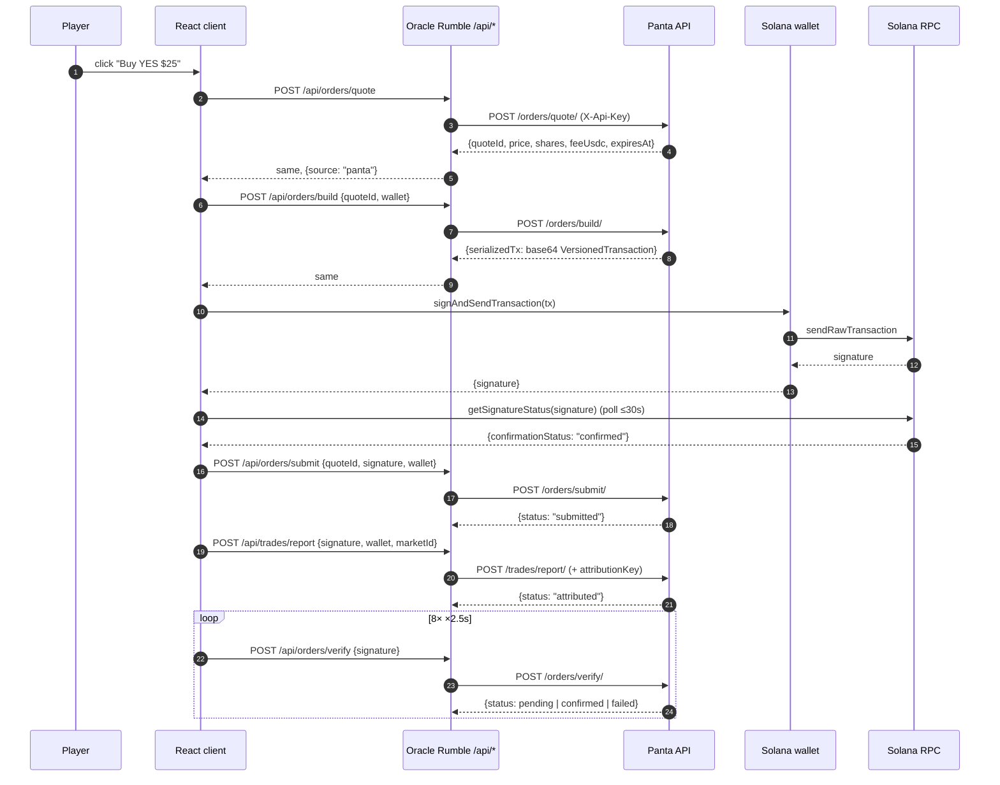
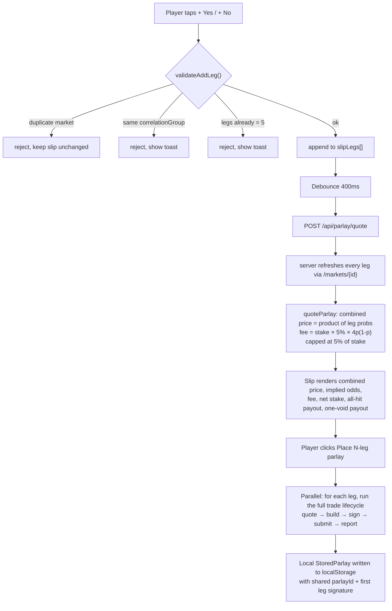
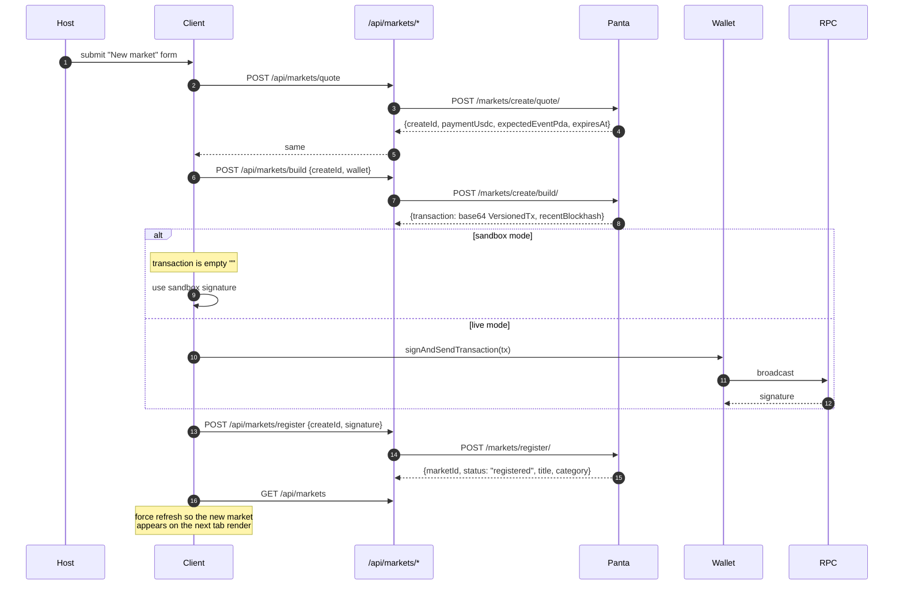

<div align="center">

# Oracle Rumble

**A prediction-market game lobby on Solana, powered by Panta.**

Live at **[oracle-rumble-production.up.railway.app](https://oracle-rumble-production.up.railway.app)**

[](https://solana.com/docs)
[](https://docs.panta.market/)
[](https://nextjs.org)
[](https://react.dev)
[](https://railway.app)

</div>

---

## Contents

1. [Overview](#overview)
2. [How the system works](#how-the-system-works)
   * [System context](#system-context)
   * [Data-source lifecycle](#data-source-lifecycle)
   * [Wallet lifecycle](#wallet-lifecycle)
   * [Trading lifecycle](#trading-lifecycle)
   * [Parlay lifecycle](#parlay-lifecycle)
   * [Market creation lifecycle](#market-creation-lifecycle)
   * [Positions & claims](#positions--claims)
   * [Attribution](#attribution)
   * [Failure modes](#failure-modes)
3. [Panta API surface](#panta-api-surface)
4. [Parlay engine](#parlay-engine)
5. [Data model](#data-model)
6. [State management](#state-management)
7. [Development](#development)
8. [Shipping more markets](#shipping-more-markets)
9. [Deploy](#deploy)
10. [Repo layout](#repo-layout)

---

## Overview

Oracle Rumble is the **experience layer** for prediction markets. [Panta](https://www.panta.market/) is the **market layer**. Players enter themed rings (rumbles), take YES/NO positions from their Solana wallet, stack legs into parlays, and settle on-chain via Panta's USDC-quoted bonding curve. Every buy, claim, market creation, and attribution runs the real Panta HTTP lifecycle on Solana devnet or mainnet.

The frontend is a Next.js 15 App-Router app deployed to Railway. Every server route under `app/api/*` is a typed 1:1 proxy over Panta's REST surface with a deterministic mock fallback for local development. Client-side signing goes through `@solana/web3.js` and the connected wallet extension (Phantom, Backpack, or Solflare) — Oracle Rumble never holds funds and never sees a private key.

---

## How the system works

### System context

```
┌───────────────────────────────────────────────────────────────────────┐
│  Player's browser                                                     │
│  ─ React 19 client component (~940 lines, one file)                   │
│  ─ Wallet: Phantom / Backpack / Solflare via @solana/web3.js          │
│  ─ Parlay engine + validation: lib/parlay.ts (pure functions)         │
│  ─ Session state: React + localStorage (positions, parlays, drafts)   │
└───────────────────────────────────────────────────────────────────────┘
                    ▲                          │
                fetch│                         │signAndSendTransaction
                    │                          ▼
┌───────────────────────────────────────────────────────────────────────┐
│  Oracle Rumble server (Next.js App Router)                            │
│  ─ 15 typed route handlers under app/api/*                            │
│  ─ Injects X-Api-Key server-side; never touches the client bundle     │
│  ─ Deterministic mock fallback when PANTA_API_KEY is empty            │
└───────────────────────────────────────────────────────────────────────┘
                    ▲                          ▲
                    │X-Api-Key                 │Solana RPC
                    ▼                          │
┌────────────────────────────────┐   ┌────────────────────────────────┐
│  Panta API                     │   │  Solana cluster                │
│  live-api.panta.market/api/v1  │   │  devnet / mainnet-beta         │
│  ─ /markets, /orders,          │   │  ─ VersionedTransaction        │
│    /positions, /claims,        │   │    signing + broadcast         │
│    /trades, /markets/create/   │   │  ─ getSignatureStatus polling  │
└────────────────────────────────┘   └────────────────────────────────┘
```

**Trust boundaries.** The client never sees `PANTA_API_KEY`; it goes into `X-Api-Key` inside every server-side proxy call. The server never sees a private key; it only ships unsigned `VersionedTransaction` bytes to the browser, which the wallet extension signs. Panta observes on-chain confirmations independently and Oracle Rumble reports the signature so trades get partner-attributed.

---

### Data-source lifecycle

The server has one mode toggle: `PANTA_API_KEY` set or unset.

```
                            ┌─────────────────────────────┐
                            │ Boot: check PANTA_API_KEY   │
                            └───────────────┬─────────────┘
                                            │
                       ┌────────────────────┴────────────────────┐
                   set │                                         │ empty
                       ▼                                         ▼
        ┌────────────────────────────┐          ┌────────────────────────────┐
        │  PANTA_LIVE = true         │          │  PANTA_LIVE = false        │
        │  every /api/* route        │          │  every /api/* route serves │
        │  proxies to live-api.…     │          │  deterministic mock data   │
        │  UI badge: LIVE · devnet   │          │  UI badge: DEMO            │
        └────────────────────────────┘          └────────────────────────────┘
```

**Every server route is written twice** in one function:

```ts
if (PANTA_LIVE) {
  try { return NextResponse.json({ source: "panta", ...(await pantaFetch(...)) }); }
  catch (err) { /* fall through to mock so the UI never breaks */ }
}
return NextResponse.json({ source: "mock", ... });
```

The `source` field flows to the client, which flips the HUD badge from `DEMO` to `LIVE · devnet` and takes the random-walk price ticker offline in live mode (Panta is the source of truth then, refreshed every 20 s).

---

### Wallet lifecycle

```
      ┌──────────────────────────┐
      │  Player clicks "Connect" │
      └──────────────┬───────────┘
                     ▼
      ┌──────────────────────────────────────────────┐
      │ connectSolanaWallet()                        │
      │  probes window.phantom.solana                │
      │       ↓ else window.solana                   │
      │       ↓ else window.backpack.solana          │
      │       ↓ else window.solflare                 │
      └──────────────┬───────────────────────────────┘
                     │
          ┌──────────┴───────────┐
          │                      │
      wallet found          no wallet
          │                      │
          ▼                      ▼
   provider.connect()      toast: "Install Phantom /
   returns publicKey       Backpack / Solflare"
   → persisted to
     localStorage
```

There is **no demo-wallet fallback**. A player without a Solana wallet cannot sign, and the app refuses to fake it. `signAndBroadcast` throws `WalletUnavailableError` if none is present and `WalletSignatureError` on any signing failure — no mock signature ever slips into the trade lifecycle.

---

### Trading lifecycle

Every YES/NO buy runs the same five-step ceremony through Panta's REST API and the Solana RPC. All five steps are visible in the network inspector.



**Where each step lives in the code:**

| Step | Code |
| :-- | :-- |
| Quote | `trade()` in [`app/page.tsx`](app/page.tsx) → `quoteOrder()` in [`lib/panta-client.ts`](lib/panta-client.ts) → [`app/api/orders/quote/route.ts`](app/api/orders/quote/route.ts) |
| Build | `buildOrder()` → [`app/api/orders/build/route.ts`](app/api/orders/build/route.ts) |
| Sign + broadcast | `signAndBroadcast()` in [`lib/panta-client.ts`](lib/panta-client.ts) — deserializes base64 into `VersionedTransaction`, hands to wallet, polls `getSignatureStatus` |
| Submit | `submitOrder()` → [`app/api/orders/submit/route.ts`](app/api/orders/submit/route.ts) |
| Attribute | `reportTrade()` → [`app/api/trades/report/route.ts`](app/api/trades/report/route.ts) — server injects `PANTA_ATTRIBUTION_KEY` |
| Verify (async) | `verifyOrder()` → [`app/api/orders/verify/route.ts`](app/api/orders/verify/route.ts) — polled up to 8× after submit |

---

### Parlay lifecycle

A parlay is not a first-class Panta product; it's a **client-space bundle** of N linked single orders that share a client-side `parlayId`. Pricing is dynamic, refreshed from the live single-market book on every leg change.



**Correlation blocks** — legs on the same market or with the same `correlationGroup` are rejected before they ever reach a quote. Example: within the Fight Night ring, the KO-YES and Decision-YES markets both carry `correlationGroup: "fn-main-outcome"` because a fight ends one way or the other. Adding one after the other yields:

> **"Correlated with 'Will the main event end by knockout?' — parlayit-style correlation block."**

**Variance-based fee** — `stake × 5% × 4p(1-p)` per leg, where `p = price/100`. Peaks at coinflip legs (`p = 0.5` → full 5% × stake), decays to near-zero at high-conviction legs (`p = 0.05` or `p = 0.95` → ~0.95% × stake). Aggregate is capped at `PARLAY_FEE_CAP = 5%` of stake.

**50/50 fallback** — a voided leg pays 0.5×, so the parlay's payout is halved once per voided leg. The slip shows both **all-hit payout** and **one-void payout** so the downside is visible before you sign.

---

### Market creation lifecycle

Hosts create real Panta markets in-app via the Host modal (or via the batch seeder, [see below](#shipping-more-markets)).



**Fields sent to `/markets/create/quote/`** — the wire format is Panta's; deviate and you get a 400.

| Field | Type | Notes |
| :-- | :-- | :-- |
| `wallet` | base58 pubkey | Fee payer + on-chain signer |
| `question` | string | ≤ 512 chars |
| `resolutionRule` | string | ≤ 2048 chars — how the market resolves |
| `sourcesOfTruth` | string[] | 1–20 URLs used to adjudicate resolution |
| `category` | enum | `sports` \| `crypto` \| `politics` \| `entertainment` \| `finance` \| `science` \| `world` \| `other` |
| `startTime` | unix seconds | Market open time |
| `endTime` | unix seconds | Trading close time |
| `resolutionTime` | unix seconds | Resolution deadline (recommended: `endTime + 7d`) |
| `imageUrl` | http(s) URL | Catalog image, ≤ 2048 chars |

**Fee model** — a `pk_test_*` sandbox quote returns `paymentUsdc: "50000000"` (50 USDC in base units), split into `liquidityInjectionUsdc: "10000000"` (10 USDC seeded into the bonding curve) and `platformRevenueUsdc: "40000000"` (40 USDC platform fee). Live-mode numbers depend on Panta's schedule.

---

### Positions & claims

```
┌─────────────────────────────────┐
│  Wallet connects                │
└───────────────┬─────────────────┘
                ▼
    every 12s: GET /api/positions?wallet=<pk>
                │
                ▼
    ┌──────────────────────────────────┐
    │  remotePositions state           │
    │  ─ shares, entryPrice, markPrice │
    │  ─ phase, claimable              │
    │  ─ outcome (if resolved)         │
    └──────────────────────────────────┘
                │
                ▼
    ┌────────────────────────────────────────┐
    │  Renders in "Your positions" section    │
    │  If claimable: [Claim] button          │
    │     → POST /api/claims/build            │
    │     → wallet signs, broadcasts          │
    │     → POST /api/trades/report           │
    └────────────────────────────────────────┘
```

The session ledger (in-browser `localStorage`) is separate from Panta's authoritative view. The HUD shows both: `N on-chain · M session`. Session positions are what the player has placed in this browser tab; on-chain positions are what Panta reports for the wallet address. They usually agree; if they diverge (crashed submit, another client, resolution) the Panta view is truth.

---

### Attribution

Every trade posts to `/api/trades/report` with the signature and wallet. The server enriches it with `PANTA_ATTRIBUTION_KEY` (partner attribution) before forwarding to Panta. This is how ring leaderboards will count qualifying activity once Panta ships them.

```
Client                Oracle Rumble server        Panta
  │  {signature, wallet, marketId}                   │
  │──────────────────────▶│                          │
  │                       │  +attributionKey         │
  │                       │  X-Api-Key               │
  │                       │─────────────────────────▶│
  │                       │◀── {status: attributed}──│
  │◀──────────────────────│                          │
```

---

### Failure modes

The system is designed to fail loudly rather than silently. Every path has an explicit outcome.

| What broke | What happens |
| :-- | :-- |
| **No `PANTA_API_KEY` on the server** | Every route returns `source: "mock"` with a deterministic payload. UI badge reads `DEMO`. Every button still works locally. |
| **Panta returns 5xx** | Server-side proxy catches, logs, falls through to mock. `source: "mock"` in the response tells the client not to trust prices. |
| **No wallet extension detected** | `connect()` shows a toast pointing at Phantom / Backpack / Solflare install pages. No fake wallet is spun up. |
| **Wallet rejects signature** | `signAndBroadcast` throws `WalletSignatureError`. The trade / claim / market-create UI resets and toasts the error. Nothing is written locally. |
| **RPC never confirms** | 30 s timeout inside `signAndBroadcast`. Trade returns `confirmed: false`. Post-submit `/orders/verify` poll continues asynchronously for another 20 s. |
| **Parlay leg conflict** | `validateAddLeg` rejects before the quote is even requested. Toast names the conflicting leg. |
| **Panta 400 on market create** | Registration failure caught; the draft ring stays in the local `hosted[]` list so the player doesn't lose their question text. |

---

## Panta API surface

Every route below is implemented as a Next.js proxy under `app/api/`. **The Panta API key never leaves the server.**

### Catalog

| Oracle Rumble | Panta | Purpose |
| :-- | :-- | :-- |
| `GET /api/markets` | `GET /markets/` | Full catalog, grouped into rings by category |
| `GET /api/markets/[id]` | `GET /markets/{id}/` | Single market catalog row |
| `GET /api/markets/[id]/trades` | `GET /markets/{id}/trades/` | Live fill tape for one market |
| `GET /api/categories` | `GET /markets/categories/` | Allowlist (with fallback to catalog-derived) |

### Trading

| Oracle Rumble | Panta |
| :-- | :-- |
| `POST /api/orders/quote` | `POST /orders/quote/` |
| `POST /api/orders/build` | `POST /orders/build/` |
| `POST /api/orders/submit` | `POST /orders/submit/` |
| `POST /api/orders/verify` | `POST /orders/verify/` |
| `POST /api/trades/report` | `POST /trades/report/` |
| `POST /api/parlay/quote` | *client-space — refreshes each leg from `/markets/{id}/`* |

### Positions & claims

| Oracle Rumble | Panta |
| :-- | :-- |
| `GET /api/positions?wallet=` | `GET /positions/?wallet=` |
| `POST /api/claims/build` | `POST /claims/build/` |

### Market creation

| Oracle Rumble | Panta |
| :-- | :-- |
| `POST /api/markets/quote` | `POST /markets/create/quote/` |
| `POST /api/markets/build` | `POST /markets/create/build/` |
| `POST /api/markets/register` | `POST /markets/register/` |

---

## Parlay engine

All math and validation lives in [`lib/parlay.ts`](lib/parlay.ts) — pure functions, no I/O, unit-testable.

```ts
export const PARLAY_MIN_LEGS = 2;
export const PARLAY_MAX_LEGS = 5;
export const PARLAY_FEE_RATE = 0.05;   // peak per-leg fee at p = 0.5
export const PARLAY_FEE_CAP  = 0.05;   // aggregate cap on stake

// Per-leg fee, normalized so p=0.5 costs full rate, p→0 or p→1 costs 0.
function legFee(stake: number, priceCents: number): number {
  const p = Math.max(0.01, Math.min(0.99, priceCents / 100));
  return stake * PARLAY_FEE_RATE * 4 * p * (1 - p);
}

// Combined price = product of leg probabilities × 100.
// e.g. two legs at 64¢ and 47¢ → 0.64 × 0.47 = 0.3008 → 30.08¢.
function quoteParlay(legs, stake) {
  const legFees = legs.map(l => legFee(stake, l.price));
  const fee    = Math.min(sum(legFees), stake * PARLAY_FEE_CAP);
  const net    = stake - fee;
  const prob   = legs.reduce((acc, l) => acc * (l.price / 100), 1);
  const shares = net / prob;
  return { combinedPrice: prob * 100, fee, netStake: net, shares,
           allHitPayout: shares, halfOnVoidPayout: shares * 0.5 };
}
```

**Correlation blocks** are enforced two places:

- Client-side, on every `addLegToSlip` via `validateAddLeg(legs, candidate)`.
- Server-side, on every `/api/parlay/quote` via `validateParlay(legs)` before pricing.

Legs share a group when their underlying markets have the same `correlationGroup` string. Adding a second leg from the same group returns HTTP 422 with a plain-English reason. Duplicate markets are rejected the same way.

---

## Data model

```ts
// lib/panta.ts — server-side types (Panta wire shape, normalized).
type PantaMarket = {
  id: string; question: string; category: string;
  yesPrice: number;              // cents 0..100
  change: number;                // cents, 24h delta
  volume: string;                // formatted, e.g. "$42.8k"
  closes: string;                // formatted, e.g. "Closes in 8d"
  phase: "active" | "resolved" | "graduated" | "pending";
  outcome?: "YES" | "NO" | null;
  correlationGroup?: string;
};

type PantaPosition = {
  marketId: string; question: string; side: "YES" | "NO";
  shares: number; entryPrice: number; markPrice: number;
  cost: string; phase: string; claimable: boolean;
  outcome?: "YES" | "NO" | null;
};

// lib/arena-data.ts — session-only types.
type Position = { id, arenaId, marketId, question, side, entryPrice,
                  shares, cost, ts, signature?, quoteId? };

type StoredParlay = { id, arenaId, ts, legs[], combinedPrice, stake,
                      fee, shares, potentialPayout, signature? };

// lib/parlay.ts — the parlay ADT.
type ParlayLeg   = { marketId, question, side, price, correlationGroup? };
type ParlayQuote = { legs, combinedPrice, impliedOdds, stakeUsdc,
                     legFees[], feeUsdc, netStakeUsdc, shares,
                     potentialPayoutUsdc, halfPayoutIfOneVoidUsdc,
                     validUntil };
```

---

## State management

No Redux, no Zustand — the entire client is one React component with a set of `useState` + `useEffect` hooks. Persistence goes through `localStorage` under `oracle-rumble/state/v3`.

| State | Origin | Persistence |
| :-- | :-- | :-- |
| `arenas` | server (`/api/markets`) | in-memory only; refreshed every 20 s in live mode |
| `walletAddress`, `walletKind` | wallet extension via `connectSolanaWallet()` | localStorage |
| `positions` (session ledger) | local, from every successful trade | localStorage |
| `parlays` (session ledger) | local, from every successful parlay placement | localStorage |
| `hosted` (draft rings) | local, from Host modal | localStorage |
| `remotePositions` | server (`/api/positions?wallet=`) | in-memory, refreshed every 12 s |
| `marketTrades` | server (`/api/markets/[id]/trades`) | in-memory, refreshed every 8 s |
| `slipLegs`, `slipStake` | local | not persisted (session-only) |
| `dataSource` | server response `source` field | derived per fetch |
| `serverQuote` (parlay) | server (`/api/parlay/quote`), 400 ms debounced | not persisted |

---

## Development

```bash
# 1. Install
npm install

# 2. Optional: point at real Panta (see .env.example)
cp .env.example .env.local
# fill PANTA_API_KEY=pk_test_… — get one via docs.panta.market/quickstart

# 3. Run
npm run dev           # http://localhost:3000

# 4. Type-check
npm run lint          # tsc --noEmit

# 5. Production build
npm run build && npm run start
```

Without a `PANTA_API_KEY`, every server route returns deterministic mock data — the full UI renders and every button still works. Great for local iteration on the client without an internet dependency.

### Environment

| Variable | Purpose |
| :-- | :-- |
| `PANTA_API_KEY` | `pk_test_*` for devnet, `pk_live_*` for mainnet. Server-side only. |
| `PANTA_API_BASE` | Defaults to `https://live-api.panta.market/api/v1`. |
| `PANTA_ATTRIBUTION_KEY` | Partner attribution key sent with `/trades/report`. |
| `NEXT_PUBLIC_SOLANA_RPC` | Client-side RPC. Defaults to `https://api.devnet.solana.com`. |
| `NEXT_PUBLIC_SOLANA_CLUSTER` | UI label — `devnet`, `testnet`, or `mainnet-beta`. |

---

## Shipping more markets

The batch seeder at [`scripts/seed-markets.mjs`](scripts/seed-markets.mjs) walks the questions in [`scripts/curated-markets.json`](scripts/curated-markets.json) and runs the full market-creation lifecycle against real Panta.

```bash
# Dry run — hits Panta, verifies quotes, doesn't sign or register.
npm run seed:dry

# Full lifecycle — signs with your Solana keypair, broadcasts to devnet,
# registers with Panta.
export PANTA_API_KEY=pk_test_…
npm run seed:devnet -- --keypair ~/.config/solana/id.json
```

Each entry in the JSON must satisfy Panta's `/markets/create/quote/` schema:

- `question` (≤ 512 chars)
- `resolutionRule` (≤ 2048 chars)
- `sourcesOfTruth` (1–20 URLs)
- `category` — one of `sports`, `crypto`, `politics`, `entertainment`, `finance`, `science`, `world`, `other`
- `imageUrl` (http/https, ≤ 2048 chars)
- `endTime` (ISO 8601)

> **Sandbox note.** A `pk_test_*` key returns a fixed sandbox fixture — every quote yields the same `createId` and every registration collapses onto the single `TestMarket1111…` pubkey. The seeder still walks the full pipeline, so a swap to `pk_live_*` needs zero code change.

---

## Deploy

Ships with a Nixpacks plan and `railway.json` — one command to production.

```bash
railway up --service oracle-rumble
```

- [`nixpacks.toml`](nixpacks.toml) pins Node 20 and runs `npm ci` → `npm run build` → `npm run start`.
- [`railway.json`](railway.json) sets the `/` healthcheck, a 100 s startup budget, and an on-failure restart policy with 3 retries.

Set env vars via `railway variables --set K=V` or the service Variables tab. Railway auto-redeploys on env change.

---

## Repo layout

```
app/
  layout.tsx                      root metadata
  page.tsx                        client UI (~940 lines, one component)
  globals.css                     theme + layout
  api/
    categories/                   allowlist of Panta categories
    claims/build/                 claim_win_usdc proxy
    markets/                      list + [id] + [id]/trades
      quote/  build/  register/   market-creation lifecycle proxies
    orders/                       quote → build → submit → verify
    parlay/quote/                 dynamic parlay pricing
    positions/                    wallet-scoped positions
    trades/report/                partner attribution
lib/
  arena-data.ts                   session types + optional seed
  panta.ts                        server-side Panta client + types
  panta-client.ts                 browser helpers + real Solana signing
  parlay.ts                       parlay math (variance fee · correlation · 50/50)
scripts/
  seed-markets.mjs                batch market seeder
  curated-markets.json            8 seeded questions
nixpacks.toml                     Railway build plan
railway.json                      Railway deploy config
```

---

## Credits

- **Panta** — the market layer. [docs](https://docs.panta.market/) · [website](https://www.panta.market/) · [playground](https://github.com/Kaito-HQ/panta-api-playground)
- **Solana** — settlement. [docs](https://solana.com/docs) · ~400 ms slot times · USDC 1:1
- **ParlayIt** — parlay mechanics inspiration. [docs](https://docs.parlayit.gg/)
- **Next.js 15**, **React 19**, **@solana/web3.js**

---

<div align="center">

*Call it. Prove it. Climb.*

</div>
